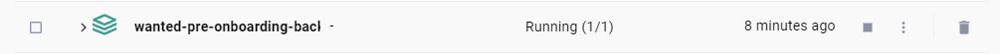
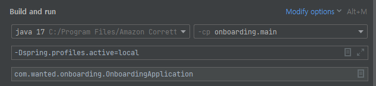
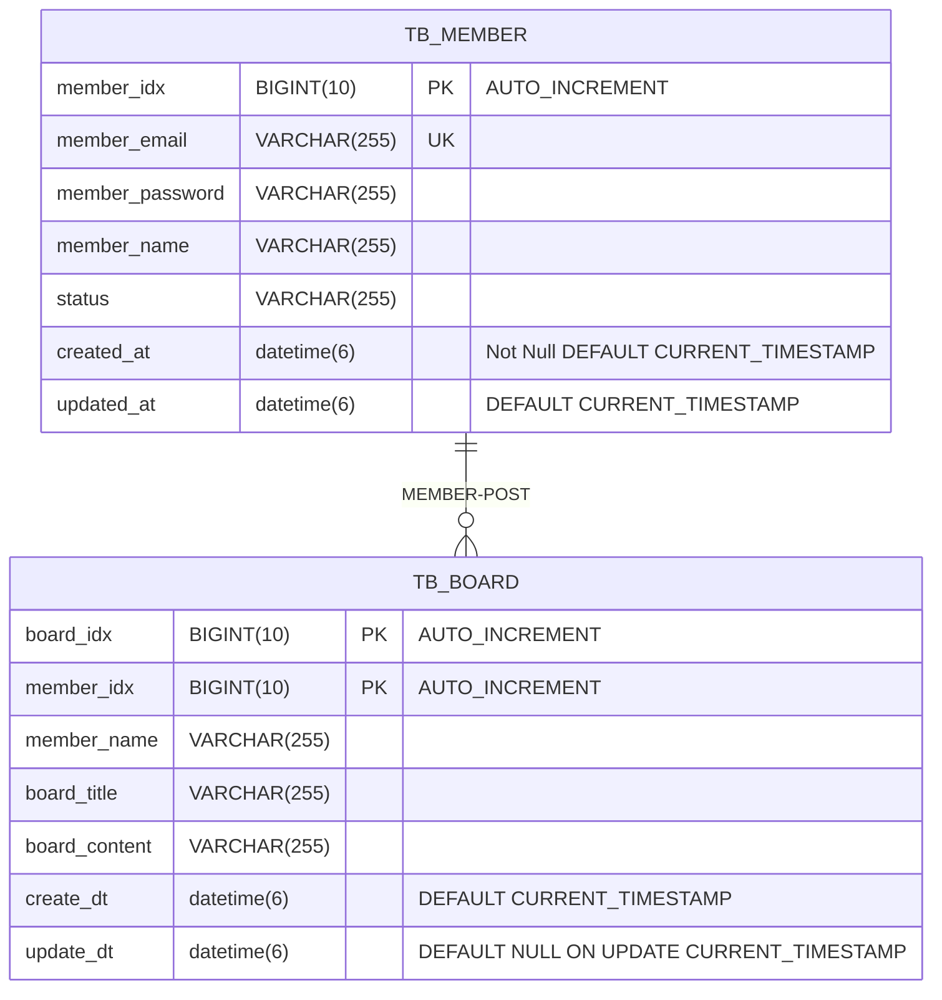

# wanted-pre-onboarding-backend

## 1. 지원자의 성명

- 노기훈
- 563710@naver.com
<br/>

## 2. docker-compose 실행 방법 ++

터미널<../wanted-pre-onboarding-backend>: 
    `docker-compose up -d`
<br/>
## 3. 애플리케이션의 실행 방법
`3-1. docker 실행후 컨테이너 실행`

---

<br/>

`3-2. 개발환경 ?  VMoption 로컬로 실행 : VM 옵션 공백`

---

<br/>
`-Dspring.profiles.active=local`추가
<br/>
`3-3. 실행`

---
`OnboardingApplication` run
<br/>
`3-4. 엔드 포인트 호출 방법`

---
| description | method | url                    | permission |
| ---- | ---- |------------------------| ----|
| 회원가입 | `POST` | /api/signup            | `AllowAny` |
| 로그인 | `POST` | /api/login             | `AllowAny` |
| 게시글 목록 조회 | `GET` | /api/board/list        | `AllowAny` |
| 특정 게시글 조회 | `GET` | /api/board/{"board_id"}| `AllowAny`|
| 게시글 작성 | `POST` | /api/board             | `IsAuthenticated` |
| 특정 게시글 수정 | `PUT` | /api/board/{"board_id"}| `IsAuthenticated` |
| 특정 게시글 삭제 | `DELETE` | /api/board/{"board_id"} | `IsAuthenticated` |

`{"board_id"} = int:pk`
<br/>

## 4. 데이터베이스 테이블 구조


## 5.구현한 API의 동작을 촬영한 데모 영상 링크


## 6. 구현 방법 및 이유에 대한 간략한 설명


### `6-1. member`

---
회원가입(`SignUp`)
- 클라이언트에서 이메일과 비밀번호를 입력받아 유효성을 검증합니다.
  - 이메일은 '@'를 포함해야 합니다.
  - 비밀번호는 8자 이상이어야 합니다.
- 유효성 검사가 통과되면 DB에 저장합니다. 
  - 비밀번호는 시큐리티의 passwordEncoder로 암호화됩니다.
  - 회원가입시 status가 ACTIVE상태로 저장됩니다.
    - (status로 회원의 상태를 관리합니다.(정지,탈퇴,휴먼 ...))
- 회원가입 성공 시 ture 반환해 줍니다.<br>

---

로그인(`Login`)
- 클라이언트에서 이메일과 비밀번호를 입력받아 유효성을 검증합니다.(유효성은 회원가입과 같습니다.)
- 입력 받은 값을 DB에서 조회하여 같은 아이디가 있는지 유효성 검사를 합니다.
  - 중복된 아이디거나 비밀번호를 passwordEncoder.matches()를 사용하여 일치하지 않는 경우 예외처리 됩니다.
- 시큐리티 인증에 성공하면, JWT를 생성하여 access token을 반환해 줍니다.

### `6-2. board`

---

게시글 목록 조회(`Board-List`)
- 한 페이지에 게시글 `5`개를 조회합니다.
  - 페이지는 `1페이지`부터 시작합니다.
- 작성시간(`CreatedAt`)을 기준으로 정렬하여 조회합니다.

---

게시글 내용 조회(`Board-ById`)
- 게시글의 ID를 기반으로 특정 게시물을 조회합니다.
  - DB에 `Id`가 없다면 예외처리 됩니다.
---

게시글 작성(`Board-Create`)
- 엑세스토큰을 시큐리티에서 검증하여 검증된 객체(사용자)만 게시글 작성이 가능합니다.
- 클라이언트에서 `[title, content]` 를 입력받고 제목이 중복되면 예외처리를 합니다.
- 예외처리를 통과하면 새로운 게시글을 DB에 저장합니다.

---

게시글 수정(`Board-Update`)
- 엑세스토큰을 시큐리티에서 검증하여 검증된 객체(사용자)가 게시물의 작성자와 일치하면 게시글 수정이 가능합니다.
  - 작성자와 일치하지 않으면 예외처리 합니다.

---

게시글 삭제(`Board-Delete`)
- 엑세스토큰을 시큐리티에서 검증하여 검증된 객체(사용자)가 게시물의 작성자와 일치하면 게시글 삭제가 가능합니다.
  -   - 작성자와 일치하지 않으면 예외처리 합니다.


## 7.  API 명세(request/response 포함)


`Postman.json`:
[Wanted Project Api.postman_collection.json](..%2F..%2F..%2FWanted%20Project%20Api.postman_collection.json)


### `Member`

---

회원가입  `POST` <br>

<details>
<summary> Request </summary>

| Parameter | Description   |
| --- |---------------|
| email | email 형식(@포함) |
| password | 최소 8자 이상      |

```json
{
    "email":"wanted@wanted.com",
    "password":"12345678"
}
```
</details>

<details>
<summary>Response</summary>

```json
{
    "success": true
}
```

#### 400 Bad Request
- 이메일이나 비밀번호가 유효성 검사에서 예외처리 될 경우


</details>

---

로그인  `POST`

<details>
<summary> Request </summary>

| Parameter | Description |
| --- | --- |
| email | 가입 된 이메일이어야한다. |
| password | 가입 했을 시 비밀번호와 같아야한다. |

```json
{
    "email":"wanted@wanted.com",
    "password":"12345678"
}
```
</details>


<details>
<summary>Response</summary>

#### HTTP 200 OK

```json
{
    "token": "access_token"
}
```

#### 400 Bad Request
- 이메일이나 비밀번호가 db에 저장 된 값과 다를 경우

```
{
    "아이디 혹은 비밀번호가 일치하지 않습니다.
}
```
</details>


### `boards`

---

게시글 목록 조회 `GET` <br>

<details>
<summary> Response </summary>

#### HTTP 200 OK
- `boardList`: 게시물 리스트(게시물 정보)
- `lastPage`: 게시물의 마지막 페이지 
```json
{
  "boardList": [
    {
      "id": 11,
      "memberId": 1,
      "title": "11번제목",
      "content": "11번 내용",
      "name": "노기훈",
      "createdAt": "2023-08-16T06:47:14.657734Z",
      "updatedAt": "2023-08-16T06:47:14.658744Z"
    },
    {
      "id": 10,
      "memberId": 1,
      "title": "10번제목",
      "content": "10번 내용",
      "name": "노기훈",
      "createdAt": "2023-08-16T06:47:11.055127Z",
      "updatedAt": "2023-08-16T06:47:11.057311Z"
    },
    {
      "id": 9,
      "memberId": 1,
      "title": "9번제목",
      "content": "9번 내용",
      "name": "노기훈",
      "createdAt": "2023-08-16T06:47:07.416478Z",
      "updatedAt": "2023-08-16T06:47:07.419358Z"
    },
    {
      "id": 8,
      "memberId": 1,
      "title": "8번제목",
      "content": "8번 내용",
      "name": "노기훈",
      "createdAt": "2023-08-16T06:47:03.981588Z",
      "updatedAt": "2023-08-16T06:47:03.983565Z"
    },
    {
      "id": 7,
      "memberId": 1,
      "title": "7번제목",
      "content": "7번 내용",
      "name": "노기훈",
      "createdAt": "2023-08-16T06:47:00.633058Z",
      "updatedAt": "2023-08-16T06:47:00.635154Z"
    }
  ],
  "lastPage": 3
}
```

</details>

---

특정 글 조회  `GET`

<details>

<summary>Response</summary>

#### HTTP 200 OK

```json
{
    "boardId": 1,
    "MemberId": 1,
    "title": "1번제목",
    "content": "1번 내용",
    "name": "노기훈",
    "createdAt": "2023-08-16T06:46:35.162378Z",
    "updatedAt": "2023-08-16T06:46:35.167120Z"
}
```
</details>

---

게시글 작성  `POST`

<details>
<summary> Request </summary>

| Parameter | Description           | Comments |
| --- |-----------------------| - |
| title | 게시글 제목                |  |
| contents | 게시글 내용                |  |

```json
{
  "title":"n번 제목",
  "content":"n번 내용"
}
```
</details>


<details>
<summary>Response</summary>

#### HTTP 200 OK

```json
{
    "success": true
}
```

#### 400 Bad Request
- 중복된 게시글 제목이거나 내용이 비었을 경우

```
{
    중복된 게시글 제목이거나 내용이 비었습니다.
}
```
</details>

---

특정 글 수정  `PUT` <br>

<details>
<summary> Request </summary>

- 작성자 본인만 수정 가능

| Parameter | Description | Comments |
| --- |------------| --- |
| title | 게시글 제목     | - |
| contents | 게시글 내용     | - |

```json
{
  "title":"n번 제목수정",
  "content":"n번 내용수정"
}
```
</details>

<details>

<summary>Response</summary>

#### HTTP 200 OK

```json
{
    "success": true
}
```

#### HTTP 400 Bad Request
- 중복된 게시글 제목이거나 내용이 비었을 경우

```
{
    중복된 게시글 제목이거나 내용이 비었습니다.
}
```

#### HTTP 401 Unauthorized
- 로그인을 하지 않았을 경우

```py
{
    "message": "로그인이 필요합니다."
}
```

#### HTTP 403 Forbidden
- 본인이 작성한 글이 아닐 경우


</details>

---

특정 글 삭제  `DELETE`

<details>
<summary> Request </summary>

- 작성자 본인만 수정 가능

</details>

<details>

<summary>Response</summary>

#### HTTP 200 OK

```json
{
    "success": true
}
```


</details>

---

## 8. Architecture(AWS 환경)


### `요구사항`
https://github.com/lordmyshepherd-edu/wanted-pre-onboardung-backend-selection-assignment
