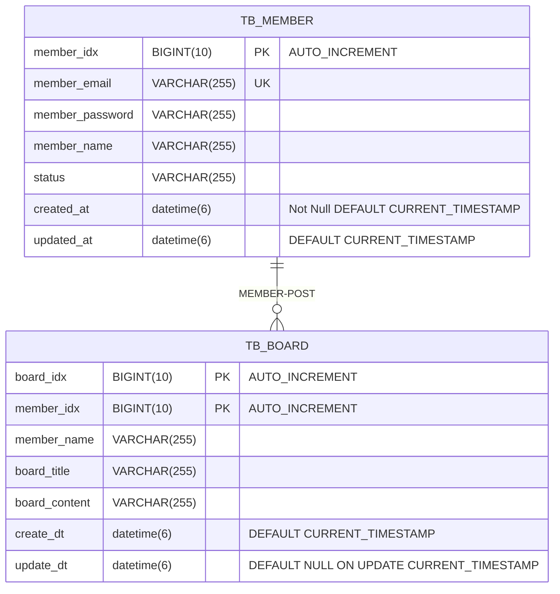

# wanted-pre-onboarding-backend

## 지원자의 성명
- 노기훈
 

## docker-compose 실행 방법
Terminal<wanted-pre-onboarding-backend>: 
    `docker-compose up -d`

## 애플리케이션의 실행 방법 (엔드포인트 호출 방법 포함)
 

### 1. docker 실행후 컨테이너 실행

 

### 2. 개발환경 ?  VMoption 로컬로 실행 : 공백

`-Dspring.profiles.active=local`

### 3. 

### 데이터베이스 테이블 구조

### 구현한 API의 동작을 촬영한 데모 영상 링크

### 구현 방법 및 이유에 대한 간략한 설명

### API 명세(request/response 포함)

https://github.com/lordmyshepherd-edu/wanted-pre-onboardung-backend-selection-assignment